  

  Software Engineer at <strong>Wyrd Media Labs</strong> · NSUT '25 · Springer-published researcher

  <a href="https://www.linkedin.com/in/ankit-bhardwaj-6b9b62221/">LinkedIn</a>
  &nbsp;·&nbsp;
  <a href="https://github.com/Ankit6149/portfolio">Portfolio</a>
  &nbsp;·&nbsp;
  <a href="https://leetcode.com/u/ankit_bh_/">LeetCode</a>
  &nbsp;·&nbsp;
  <a href="https://orcid.org/0009-0005-3408-0058">ORCID</a>
  &nbsp;·&nbsp;
  <a href="mailto:ankitbhardwaj80100@gmail.com">Email</a>

---

### About

I build full-stack products, automation systems, and AI-powered workflows—with a growing focus on **local-first software** and interfaces that connect applications, devices, and real-world actions.

At **Wyrd Media Labs**, I work on multi-channel outreach systems, WhatsApp tooling, workflow automation, tracking infrastructure, and product-management experiences. Outside work, I am building independent software products and exploring how private AI systems can safely act across a user's devices.

### Selected work

- **[Skribly](https://github.com/Ankit6149/skribly)** — contextual desktop notes and annotations that return with the relevant app, webpage, file, or screen location.
- **[SignalFlow Studio](https://github.com/Ankit6149/SignalFlow-Studio)** — a review-first workspace for turning product context into editable multi-platform content.
- **[Hardware Studio](https://github.com/Ankit6149/hardware-studio)** — an offline-first workspace for hardware architecture, BOMs, power budgets, pin routing, and prototype planning.
- **[The Ring](https://github.com/Ankit6149/the-ring)** — research and product architecture for a private BLE and haptic command interface.

### Research

**[Emotion-H Net](https://link.springer.com/chapter/10.1007/978-3-032-15407-1_18)** — a lightweight Transformer architecture for EEG emotion recognition, published in Springer LNNS after ICDSA 2025. The model achieved **86.82% accuracy**, **0.868 F1**, and **0.977 AUROC** on the DEAP dataset.

### Toolkit

`C` · `C++` · `JavaScript` · `Python` · `SQL` · `React` · `Next.js` · `Node.js` · `PostgreSQL` · `Supabase` · `Redis` · `TensorFlow` · `PyTorch` · `n8n` · `MCP`

### Beyond code

Basketball, sketching, painting, and visual design. I like products that are technically strong without forgetting how they feel to use.
