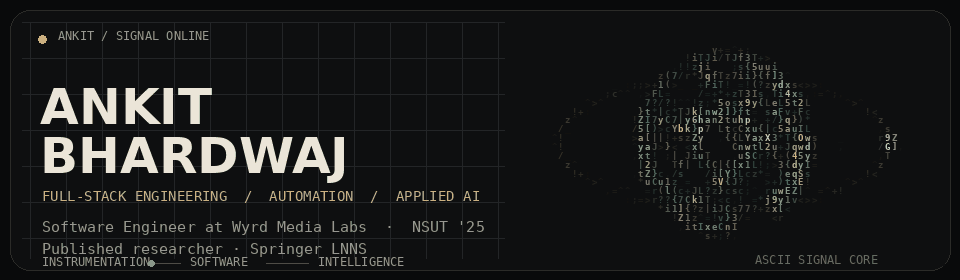

<!--
  The motion visual below is an original animation rendered with ASCILINE's
  character palette and grayscale mapping: https://github.com/YusufB5/ASCILINE
-->

  

  
  
  
  
  

## Hello

My background began in **Instrumentation & Control Engineering** and moved into software. That combination still shapes how I work: I think in signals, systems, interfaces, and failure modes—not only pages and endpoints.

I am a **Software Engineer at Wyrd Media Labs**, where I work across full-stack platforms, workflow automation, third-party integrations, tracking infrastructure, and applied AI. I care about software that is technically rigorous, visually considered, and understandable to the people using it.

## Engineering work

- Built parts of a multi-channel outreach platform integrating **Apollo, Gmail, Twilio, WhatsApp, OAuth, and workflow automation**.
- Implemented **HMAC-based email interaction tracking** and **Gmail Pub/Sub reply detection**, reducing manual follow-up tracking by approximately 60%.
- Developed a multi-session WhatsApp system with **RBAC, QR authentication, Redis caching, and chat/contact synchronization APIs**.
- Designed project-management workflows with automatic task creation, completion logic, and more than 20 workflow types.

## Selected repositories

  
  

- **[Research Paper Tracker](https://github.com/Ankit6149/Research-paper-tracker)** — a full-stack workspace for managing and analysing a paper-reading workflow.
- **[Portfolio](https://github.com/Ankit6149/portfolio)** — my project archive, experience, publications, credentials, and live coding metrics.

## Published research

**[Emotion-H Net: A Hybrid Transformer Architecture for Emotion Recognition via Multi-Feature Signal Fusion](https://link.springer.com/chapter/10.1007/978-3-032-15407-1_18)**  
Published in **Springer Lecture Notes in Networks and Systems** following ICDSA 2025.

The lightweight Transformer model achieved **86.82% accuracy**, **0.868 F1**, and **0.977 AUROC** on the DEAP EEG dataset. I worked across preprocessing, feature engineering, feature selection, imbalance handling, model development, and evaluation.

## Technologies I use

  

  
<strong>GitHub and problem-solving activity</strong>

   
  

    
    
  

## Away from the screen

Basketball, sketching, painting, and visual design. My creative work influences how I think about composition, interaction, and the small details that make software feel deliberate.
