  

  <strong>Software Engineer at Wyrd Media Labs</strong>, working across full-stack systems, automation, and applied AI—with an Instrumentation &amp; Control background and published research in EEG-based deep learning.

  I approach software as a connected system: the interface, data, integrations, reliability, and the experience of the person using it all matter together.

  
  
  
  
  

  <a href="https://link.springer.com/chapter/10.1007/978-3-032-15407-1_18"><strong>Emotion-H Net</strong></a>
  &nbsp;·&nbsp; Springer LNNS
  &nbsp;·&nbsp; 86.82% accuracy
  &nbsp;·&nbsp; 0.977 AUROC

  

