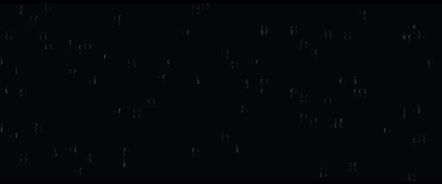

  

<h1 align="center">Ankit Bhardwaj</h1>

  <strong>Software Engineering Intern at Wyrd Media Labs</strong> 
  Creative technologist working across full-stack engineering, automation, applied AI, and thoughtful interface design.

  
  
  
  
  

---

## A little about me

Some engineers begin with code. I began with **signals, control systems, and the question of how complex things behave**.

My background in **Instrumentation & Control Engineering at NSUT** still shapes the way I build software: I look for structure, feedback, failure modes, and the clearest path from an idea to a dependable system. Today, I work across full-stack platforms, third-party integrations, workflow automation, and applied AI at **Wyrd Media Labs**.

I enjoy turning ambiguous ideas into software that feels clear, deliberate, and useful. For me, strong engineering is not only about making something work—it is also about how naturally the system fits together and how thoughtfully it meets the person using it.

  
  
  
  

## Code & problem solving

  
  

  I primarily solve in <strong>C++</strong>, with a focus on graphs, dynamic programming, trees, and system-oriented problem solving.

## Tools I reach for

  

## Beyond engineering

I am deeply curious about **biology**, particularly the way living systems sense, adapt, organise, and respond to change. I also enjoy sketching, painting, visual design, basketball, and singing. These interests influence how I think about motion, composition, interaction, and the human side of technology.

  
  

