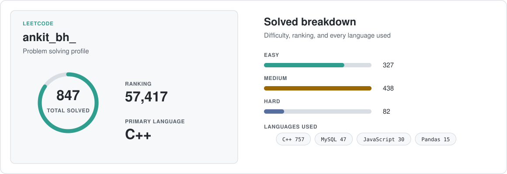

  

  <strong>Software Engineering Intern at Wyrd Media Labs</strong> 
  Signals, software, intelligent systems, design, and living systems. One connected curiosity.

  <a href="https://www.linkedin.com/in/ankit-bhardwaj-6b9b62221/">LinkedIn</a>
  &nbsp;·&nbsp;
  <a href="https://github.com/Ankit6149/portfolio">Portfolio</a>
  &nbsp;·&nbsp;
  <a href="https://leetcode.com/u/ankit_bh_/">LeetCode</a>
  &nbsp;·&nbsp;
  <a href="https://orcid.org/0009-0005-3408-0058">ORCID</a>
  &nbsp;·&nbsp;
  <a href="mailto:ankitbhardwaj80100@gmail.com">Email</a>

 

  <a href="https://leetcode.com/u/ankit_bh_/">
    <picture>
      <source media="(prefers-color-scheme: dark)" srcset="assets/leetcode-card-dark.svg" />
      <source media="(prefers-color-scheme: light)" srcset="assets/leetcode-card-light.svg" />
      
    </picture>
  </a>

  

  
<strong>The thread behind my work</strong>

   
  I studied Instrumentation &amp; Control Engineering at NSUT, which shaped how I see signals, feedback, sensing, and complex systems. That same way of thinking connects my work in full-stack software, automation, applied AI, interface design, and my curiosity about living systems. I enjoy understanding how parts interact, then turning that understanding into software that feels clear and dependable.
    
  My research has been published in <a href="https://link.springer.com/chapter/10.1007/978-3-032-15407-1_18">Springer LNNS</a>.

